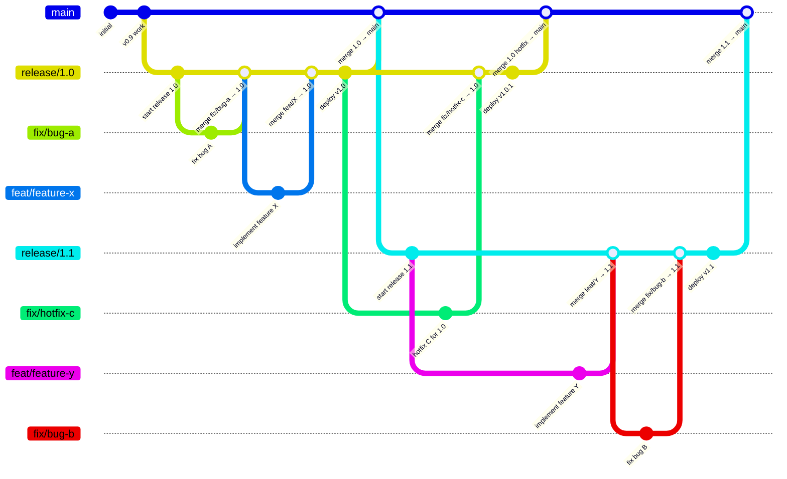

# Release Flow

## Overview

SwapVM uses a **release-branch** workflow. When a release is created, `fix/` and `feat/` branches are opened from it, merged back into the release, and the release is eventually merged into `main`. Release branches are **long-lived** — deployed contracts run on-chain for extended periods, so the branch stays open for bug-fixes and maintenance.

## Branch Diagram



## Lifecycle

```
main ─────●──────────────────────────●───────────────────────────●───────►
          │                          ▲                           ▲
          │                          │ merge                     │ merge
          │                          │                           │
release/1.0 ──●──●──deploy v1.0─────●───────●──deploy v1.0.1   │
              │  │                           │                   │
          fix/a  feat/X                  fix/hotfix-c            │
                                                                 │
                                         release/1.1 ──●──●──deploy v1.1
                                                       │  │
                                                   feat/Y fix/B
```

### release/1.0

1. Create `release/1.0` branch.
2. Create `fix/bug-a` from `release/1.0` — fix a bug, merge back into `release/1.0`.
3. Create `feat/feature-x` from `release/1.0` — implement a feature, merge back into `release/1.0`.
4. **Deploy** contracts (tag `v1.0`).
5. **Merge** `release/1.0` into `main`.
6. Branch stays open — later, `fix/hotfix-c` is created from `release/1.0` for a production issue.
7. Hotfix merged into `release/1.0`, **deploy** contracts (tag `v1.0.1`).
8. **Merge** `release/1.0` into `main` again to propagate the fix.

### release/1.1

1. Create `release/1.1` branch (includes everything already merged into `main` from 1.0).
2. Create `feat/feature-y` from `release/1.1` — implement a feature, merge back.
3. Create `fix/bug-b` from `release/1.1` — fix a bug, merge back.
4. **Deploy** contracts (tag `v1.1`).
5. **Merge** `release/1.1` into `main`.
6. Branch stays open for future maintenance of the v1.1 deployment.

## Rules

| Step | Action | Command |
|------|--------|---------|
| **1. Create release** | Create a release branch | `git checkout -b release/1.0` |
| **2. Work** | Create `fix/` or `feat/` from the release branch | `git checkout -b fix/foo release/1.0` |
| **3. Merge work** | PR into the release branch | merge `fix/foo` → `release/1.0` |
| **4. Deploy & tag** | Deploy contracts, tag the commit | `git tag v1.0` |
| **5. Merge back** | PR release branch into `main` | merge `release/1.0` → `main` |
| **6. Hotfix** | Branch from release, fix, merge back, redeploy | `git checkout -b fix/bar release/1.0` |

## Key Points

- **`main`** is the long-lived trunk; all releases eventually merge back into it.
- **`release/X.Y`** branches are **long-lived**. Deployed contracts run on-chain for extended periods, so the release branch stays open to receive bug-fixes and maintenance for as long as that deployment is supported.
- **Multiple releases can be active simultaneously** — `release/1.0` can receive hotfixes while `release/1.1` is being developed.
- **`fix/`** and **`feat/`** branches always target a specific release branch, not `main` directly.
- After merging work into the release branch, merge the release branch back into `main` to keep trunk up to date.
- A release branch is only deleted once its on-chain deployment is fully deprecated and no further patches are expected.
