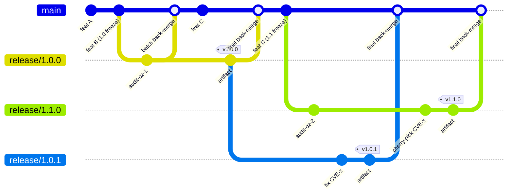

# Release Flow

Contracts are immutable and every version is a fresh deploy, so: **one release branch == one audit == one deploy == one tag.**

## Branches

**`main`** — development. All work lands via `feat/*` and `fix/*` PRs.

**`release/X.Y.Z`** — one per version, created at feature-freeze:

- MINOR/MAJOR (`release/X.Y.0`) is branched from `main`.
- PATCH (`release/X.Y.Z`, Z > 0) is branched from tag `vX.Y.(Z-1)`, never from `main` — `main` already holds next-minor work.

The branch accepts only `fix/*` and `audit-<auditor>-<finding>/*` PRs. Features go to `main` and ship in a later release.

*A feature merged into a branch under audit invalidates the audit.*

After its deploy the branch is frozen and kept. Any further change is a new `release/X.Y.(Z+1)` with its own audit and deploy. Several release branches may be in flight at once (a patch and the next minor).

| Prefix                              | Purpose                                      | Example                          |
|-------------------------------------|----------------------------------------------|----------------------------------|
| `release/X.Y.Z`                     | Single-deploy release branch, one per tag    | `release/1.0.1`                  |
| `feat/<topic>`                      | Feature, targets `main` only                 | `feat/lp-rewards`                |
| `fix/<topic>`                       | Bug fix, targets `main` or a release branch  | `fix/rounding-error`             |
| `audit-<auditor>-<finding>/<topic>` | Audit remediation, targets a release branch  | `audit-oz-3/reentrancy-on-claim` |

*Auditor and finding id in the branch name point back to the report; the finding text goes in the PR description.*

## Versioning

SemVer `vMAJOR.MINOR.PATCH`:

| Bump  | Meaning                                                      |
|-------|--------------------------------------------------------------|
| MAJOR | ABI or storage-layout break                                  |
| MINOR | Backwards-compatible addition                                |
| PATCH | Bug or security fix, no externally observable change         |

Every bump is a release branch and a deploy. No deploy, no bump.

## Lifecycle


```mermaid
gitGraph
    commit id: "feat A"
    commit id: "feat B (1.0 freeze)"
    branch "release/1.0.0"
    commit id: "audit-oz-1"
    checkout main
    merge "release/1.0.0" id: "batch back-merge"
    commit id: "feat C"
    checkout "release/1.0.0"
    commit id: "artifact" tag: "v1.0.0"
    checkout main
    merge "release/1.0.0" id: "final back-merge"
    commit id: "feat D (1.1 freeze)"
    branch "release/1.1.0"
    commit id: "audit-oz-2"
    checkout "release/1.0.0"
    branch "release/1.0.1"
    commit id: "fix CVE-x"
    commit id: "artifact " tag: "v1.0.1"
    checkout main
    merge "release/1.0.1" id: "final back-merge "
    checkout "release/1.1.0"
    commit id: "cherry-pick CVE-x"
    commit id: "artifact  " tag: "v1.1.0"
    checkout main
    merge "release/1.1.0" id: "final back-merge  "
```

1. Freeze: branch `release/X.Y.Z` (from `main`, or from the previous tag for a patch). This commit is what goes to audit.
2. Findings land as `audit-*` PRs, other bugs as `fix/*` PRs, on the release branch.
3. Maintainer merges the release branch back into `main` in batches so fixes reach the next version.
4. CI deploys, commits `deployments/<chain>/vX.Y.Z.json` to the release branch, tags that commit `vX.Y.Z`, does the final back-merge into `main`.
5. Branch is frozen. If another release branch is in flight and needs the fix, cherry-pick it there.

## Deployment artifacts

Each deploy commits `deployments/<chain>/vX.Y.Z.json` to its release branch: addresses, tx hashes, block numbers, git SHA, deployer, toolchain version, verification metadata.

## Tags

`release/X.Y.Z` produces exactly one tag `vX.Y.Z`, created by CI in the same step that commits the artifact. Tags are never moved or deleted; a mistake means a new patch release.

## Propagating fixes

- **Release → `main`:** merge in batches before the deploy; one mandatory final merge after the deploy commit. The only path from a release branch to `main`.
- **Release → release:** `git cherry-pick -x`, one PR per target, titled `backport: <title> (from release/A.B.C)`. Never merge between release branches — it drags version-specific commits along.

## Rules

1. `main` accepts only PRs.
2. `feat/*` never merges into `release/*`.
3. `release/*` accepts only `fix/*` and `audit-*/*`.
4. One production deploy per release branch; another deploy is a new branch.
5. `release/X.Y.0` branches from `main`; `release/X.Y.Z` (Z > 0) branches from tag `vX.Y.(Z-1)`.
6. Every production deploy is audited, patches included.
7. Artifact is committed before the tag exists; tags are created by CI, never moved or deleted.
8. Batch back-merges into `main` at the maintainer's discretion; final back-merge after the deploy commit is mandatory.
9. Between release branches: `cherry-pick -x` only.
10. `main` and `release/*` are protected: no force-push, no deletion.

## Commands

```bash
# freeze a minor
git checkout -b release/1.0.0 main && git push -u origin release/1.0.0

# audit fix
git checkout -b audit-oz-3/reentrancy-on-claim release/1.0.0   # PR into release/1.0.0

# batch back-merge (repeat as needed; final one after the deploy commit)
git checkout main && git pull && git merge --no-ff release/1.0.0 && git push

# patch: from the tag, not from main
git checkout -b release/1.0.1 v1.0.0 && git push -u origin release/1.0.1
git checkout -b fix/CVE-xxx release/1.0.1                      # PR into release/1.0.1

# backport to an in-flight release
git checkout -b backport/CVE-xxx-to-1.1.0 release/1.1.0
git cherry-pick -x <sha-on-release/1.0.1>                      # PR into release/1.1.0
```

## Planned: deploys from GitHub Releases

Deploys run in GitHub Actions triggered by GitHub Releases. Requirements: hermetic builds (pinned toolchain, lockfiles, no network) so `git checkout vX.Y.Z && build` reproduces on-chain bytes; a two-phase release where a draft Release on the branch HEAD triggers deploy, artifact commit and tag, then is published on the new commit; a mainnet environment with required reviewers so a deploy needs approval.
