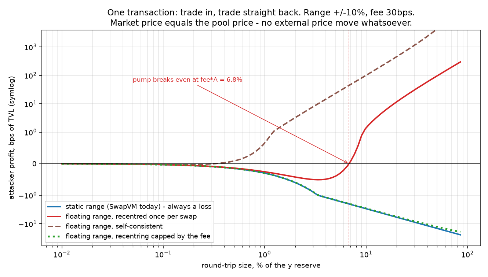
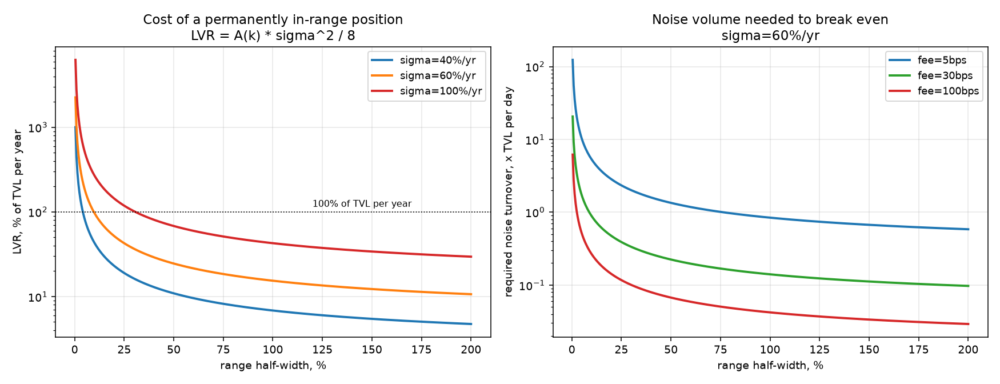
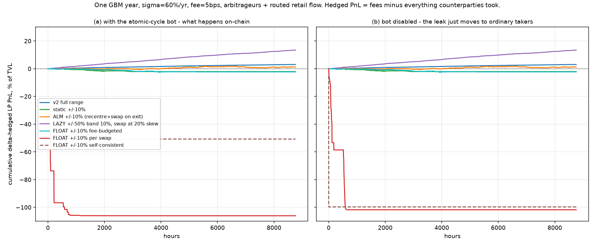

# Плавающий ценовой диапазон в AMM на Aqua — разбор идеи

Оценка идеи: концентрированная ликвидность, у которой **границы диапазона всегда равноудалены от
текущей цены** (цена 1000 → диапазон [900, 1100], цена 1050 → [950, 1150]), а **реальный своп для
ребалансировки** делается только когда цена ушла больше чем на ~50% от последней ребалансировки.

Всё, что ниже, проверено численно на модели, повторяющей арифметику
[`src/instructions/XYCConcentrate.sol`](../../src/instructions/XYCConcentrate.sol):
[`floating_range_sim.py`](floating_range_sim.py), полный вывод —
[`sim_results.txt`](sim_results.txt). Литература — статьи в [`../LVR`](../LVR) и [`../IL`](../IL).

---

## Короткий ответ

**В буквальном виде идея не работает — и не потому, что она «неоптимальна», а потому что она
создаёт денежный насос.** Правило «диапазон центрируется по текущей цене» — это моментум-член:
после каждой сделки квота сдвигается в сторону этой же сделки. Значит, «зайти и сразу выйти» в
одной транзакции становится прибыльным. Для диапазона ±10% и комиссии 30 bps один оптимальный
round-trip забирает **4.7% TVL**, девять таких циклов выносят **половину пула**, и для этого не нужно
ни движения рынка, ни второй площадки — достаточно двух свопов подряд в одной транзакции.

Три отдельных факта, которые стоит развести:

1. **Математически «всегда центрированный» диапазон = Uniswap v2.** Симметричный вокруг текущей цены
   диапазон требует `y = P·x`, то есть ровно 50/50 по стоимости; единственная кривая с постоянными
   весами — `x·y = const`. Никакой концентрации в пределе не возникает: «усиление» A живёт только
   внутри одной сделки, и именно эта разница между глубиной исполнения (A×) и движением состояния
   (как у v2) и утекает из пула.
2. **Быть «вечно в диапазоне» дорого само по себе.** LVR концентрированной позиции —
   `A·σ²/8` в год. Для ±10% (A = 21.5) при σ = 60% это **97% TVL в год**. У статического диапазона
   есть встроенный стоп: вышли за границу — перестали кровить. Плавающий диапазон этот стоп убирает.
3. **Полезная часть идеи реализуема — но иначе.** «Всегда около рынка + редкие реальные свопы»
   на Aqua получается почти бесплатно: рецентрировать надо **асимметричными границами по внешней
   цене**, а не по своей собственной. Такая версия в симуляции оказалась лучшей строкой таблицы
   (+13.6% годовых хеджированного PnL против −4% у стандартного ALM-подхода).

---

## 1. Три прочтения идеи

Стоит различать, потому что ведут они себя совершенно по-разному:

| | Правило | Что получается |
|---|---|---|
| **A. Самосогласованное** | границы всегда симметричны относительно цены, следующей из балансов | тождественно Uniswap v2, концентрации нет |
| **B. Пересчёт на каждом свопе** | после свопа `границы := [spot/k, spot·k]` | денежный насос, пул выносится |
| **C. Внешний якорь** | границы двигает оракул/кипер по рыночной цене | работает, но это уже не «плавающий диапазон», а PMM-подобная схема |

Текущий `XYCConcentrate` — stateless: `L` выводится из **текущих балансов** и **неизменных** границ
(решением инварианта v3 `(x + L/b)(y + L·a) = L²`), поэтому комиссии автоматически увеличивают `L`.
Границы лежат в неизменяемых данных ордера. Любой плавающий вариант требует **мутабельного
состояния** — см. раздел 6.

---

## 2. Ключевая математика

### 2.1 Симметричный диапазон = 50/50 по стоимости = v2

Для границ `pa = p/k`, `pb = p·k` и `m = √k`:

```
x = L·(1 - 1/m)/√p        y = L·√p·(1 - 1/m)     ⟹   y/x = p
```

То есть позиция ровно 50/50 по стоимости — при любой ширине диапазона. Из работ по LVR
(Milionis–Moallemi–Roughgarden–Zhang, `../IL/2208.06046v5.pdf`) известно: пул с постоянными весами —
это в точности weighted-geometric-mean AMM, а для 50/50 — `x·y = const`. Отсюда: если диапазон
центрируется непрерывно, кривая исполнения — это кривая v2, и вся «капитальная эффективность»
исчезает.

Виртуальные резервы при этом равны `A × реальные`, где

```
A(k) = m/(m - 1),   m = √k
```

| диапазон | ±1% | ±10% | ±50% | ±100% | ±300% |
|---|---|---|---|---|---|
| A | 201.5× | 21.5× | 5.45× | 3.41× | 2.00× |

Проверено численно: измеренное `virtual/real` совпадает с `A(k)` до 15 знаков, доля стоимости в `x`
= 0.5000 для всех ширин.

**Экономический смысл.** Глубина, которую видит тейкер, настоящая: он действительно получает
исполнение в A раз лучше. Но состояние пула после сделки уезжает так, как будто сделка прошла по
v2. Разница — не «эффективность», а субсидия из карманов LP.

### 2.2 Рецентрирование — это моментум

Ключевая механика. Узкий диапазон делает отношение балансов `y/x` сильно зашумленным по отношению к
цене: `y/x` двигается примерно в `A` раз сильнее, чем цена на кривой. Правило «центрируйся по
текущей цене» тянет квоту к цене `y/x`, то есть **в сторону последней сделки**:

```
диапазон ±10%, покупка на 1% резерва y:
  цена на кривой сдвинулась   +9.31 bps
  рецентрирование добавило    +8.87 bps   ← в ту же сторону, почти столько же
```

Одно применение правила закрывает `1/A` разрыва до цены `y/x` (измерено 0.0464 против теоретических
`1/A = 0.0465`). То есть эффективная скорость рецентрирования `θ ≈ 1/A`.

Для сравнения: существующий опкод [`Decay`](../../src/instructions/Decay.sol) (Mooniswap-style)
двигает квоту **против** разворота последней сделки и релаксирует к нулю. Это безопасное
направление. Плавающий диапазон двигает её ровно наоборот.

### 2.3 Денежный насос

Прибыль round-trip ≈ `TVL·u²·θ`, комиссия ≈ `TVL·u·fee` (u — размер относительно резерва). Значит
атака выгодна при

```
u > fee/θ ≈ fee·A
```

Измерено — совпадает:

| диапазон | A | fee | порог размера | `fee·A` |
|---|---|---|---|---|
| ±10% | 21.5 | 5 bps | 1.127% резерва | 1.074% |
| ±10% | 21.5 | 30 bps | 6.782% резерва | 6.446% |
| ±50% | 5.45 | 30 bps | 2.008% резерва | 1.635% |



Рыночная цена **равна** цене пула, никакого движения рынка нет. Статический диапазон (синий) и
вариант с бюджетным ограничением (зелёный) всегда в минусе — они консервативны. Вариант
«пересчёт на каждом свопе» (красный) переходит в плюс точно на `fee·A` и дальше растёт; полностью
самосогласованный (коричневый) прибылен почти с любого размера.

Худшие числа при комиссии 30 bps и диапазоне ±10%:

```
STATIC          0 прибыльных циклов, у LP осталось 100.000% — насоса нет
FLOAT_SPOT      9 прибыльных циклов, у LP осталось  50.000% — вынесена вся сторона y
FLOAT_FIX       1 прибыльный цикл,   у LP осталось  50.000% — половина TVL за одну транзакцию
FLOAT_BUDGET    0 прибыльных циклов, у LP осталось 100.000%
```

`FLOAT_FIX` (полностью самосогласованный вариант) умирает за одну транзакцию: атакующий выкупает
весь запас `x` практически по маржинальной цене, после чего у правила `P = y/x` **нет ограниченного
решения** (`x → 0` ⟹ `P → ∞`), и продажа `x` обратно выносит всю сторону `y`.

Важно: насос — не «баг конкретной реализации». Отключим бота атомарных циклов — утечка просто
переедет в другой канал. В симуляции без бота вариант «пересчёт на каждом свопе» теряет те же
~84% TVL, но теперь 32.6% забирают арбитражники, а **54.7% — обычные тейкеры**: пул систематически
квотирует цену, не соответствующую его инвентарю, и это подбирает кто угодно.

### 2.4 Сколько стоит «всегда быть в диапазоне»

`LVR = A·σ²/8` в год (пока цена внутри диапазона):

| диапазон | A | σ=20% | σ=40% | σ=60% | σ=100% |
|---|---|---|---|---|---|
| ±1% | 201.5 | 100.7% | 403.0% | 906.7% | 2518.7% |
| ±10% | 21.5 | 10.7% | 43.0% | **96.7%** | 268.6% |
| ±50% | 5.45 | 2.7% | 10.9% | 24.5% | 68.1% |
| v2 | 1.0 | 0.5% | 2.0% | 4.5% | 12.5% |

Оборот «нетоксичного» потока, нужный чтобы это отбить (`A·σ²/(8·fee)`), в TVL в день:

| диапазон | fee=5bps, σ=60% | fee=30bps, σ=60% |
|---|---|---|
| ±1% | 49.7× | 8.3× |
| ±10% | 5.3× | 0.88× |
| ±50% | 1.34× | 0.22× |
| v2 | 0.25× | 0.04× |



Это цифры для **любой** всегда-в-диапазоне позиции, включая «правильную» версию идеи. У
статического диапазона LVR обнуляется за границей — там гамма равна нулю, позиция превращается в
исполненный лимитный ордер. Плавающий диапазон отказывается от этого стопа добровольно.

Валидация: в рыночной симуляции измеренный отбор арбитражников у ALM ±10% составил 102% TVL в год
против аналитических 96.7% — модель воспроизводит теорию.

---

## 3. Рыночная симуляция

GBM (σ = 60%/год, 8760 шагов, 8 путей), арбитражники с оптимальным размером, ретейл-поток, который
маршрутизируется между пулом и альтернативной площадкой (толерантность 10 bps), комиссия 5 bps,
TVL $2M. Поток откалиброван так, чтобы **стандартный ALM-подход был примерно в нуле** — это
соответствует эмпирике Fritsch–Canidio (`../IL/2404.05803v2.pdf`): для крупных ETH-пулов комиссии
составляют 0.8–1.2 от арбитражных потерь. Метрика — хеджированный PnL (`комиссии` минус всё, что
забрали контрагенты), он не зависит от реализованного пути цены.

| стратегия | хедж. PnL | худший путь | комиссии | арбитраж | насос | оборот | свопы | одностор. |
|---|---|---|---|---|---|---|---|---|
| v2 full range | **+3.4%** | +2.3% | 7.8% | 10.4% | 0% | 139× | 0 | 0% |
| static ±10% | −4.0% | −15.8% | 23.6% | 28.7% | 0% | 393× | 0 | 77% |
| static ±50% | +8.7% | +1.6% | 26.1% | 30.1% | 0% | 462× | 0 | 39% |
| ALM ±10% (реценр.+своп при выходе) | −4.1% | −19.1% | 85.1% | 102.0% | 0% | 1475× | 36 | 0.2% |
| **FLOAT ±10% на каждом свопе** | **−82.4%** | −106.1% | 0.8% | 7.9% | **61.3%** | 2× | 0 | 99.9% |
| **FLOAT ±10% самосогласованный** | **−51.9%** | −53.8% | 0.0% | 0.0% | **51.9%** | 0× | 0 | 100% |
| **FLOAT ±50% на каждом свопе** | **−82.8%** | −113.3% | 0.3% | 7.4% | **61.7%** | 1× | 0 | 99.9% |
| FLOAT ±10% с бюджетом на сдвиг | −3.6% | −12.5% | 32.8% | 40.6% | 0% | 571× | 0 | 65% |
| LAZY ±10%, полоса 5%, своп при перекосе 50% | −1.2% | −13.7% | 86.0% | 99.7% | 0% | 1496× | 111 | 0% |
| LAZY ±10%, полоса 5%, своп при перекосе 20% | +0.0% | −13.6% | 85.7% | 95.9% | 0% | 1500× | 699 | 0% |
| **LAZY ±50%, полоса 10%, своп при перекосе 20%** | **+13.6%** | +11.4% | 38.3% | 45.1% | 0% | 686× | 50 | 0% |



Что читается из таблицы:

- Буквальные варианты (`FLOAT`) теряют 50–100% TVL за год и почти всё время стоят с одной стороной
  инвентаря. Это не «плохая доходность», это раздача.
- Отключение бота атомарных циклов не спасает: −83.9% / −87.8% / −100.2%, потери переезжают
  к арбитражникам и тейкерам.
- Безопасная версия с ограничением сдвига (`FLOAT_BUDGET`) выходит в −3.6%, но она почти не
  плавает — по сути статический диапазон.
- `LAZY` — рецентрирование по внешней цене асимметричными границами — лучшая строка. И лучший
  вариант там **широкий** (±50%, A = 5.45), а не узкий: концентрация при σ = 60% себя не отбивает,
  а вот «всегда около рынка» — отбивает.
- Триггер реального свопа важен меньше ширины: 50% перекоса → 111 свопов и −1.2%; 20% → 699 свопов
  и +0.0%; с диапазоном ±50% хватает 50 свопов в год для +13.6%.

---

## 4. Ответы на вопросы

### 4.1 Какие преимущества и кому

**Тейкеры — выигрывают, и это реально.** Глубина у touch в A раз больше, квота есть всегда (нет
«вне диапазона»), меньше фрагментации для роутера. В симуляции пул с плавающим диапазоном отдавал
тейкерам 13–55% TVL в год излишка относительно альтернативной площадки. Проблема ровно в том, что
это не заработок на потоке, а трансфер от LP.

**Арбитражники — главные бенефициары.** Они получают (а) удвоенную гамму без стопа,
(б) атомарный цикл без рыночного риска и без второй площадки, (в) исполнение большого размера с
маленьким слипеджем. По логике whitepaper Aqua («unfair volumes — это дополнительная выручка») это
выглядит как рост объёма, но здесь объём не платит комиссию, сопоставимую с тем, что уносит.

**LP — из настоящих плюсов остаётся только операционка**, и она достигается другими средствами:
капитал не простаивает вне диапазона; не нужен мониторинг и ручной перезаход; комиссии
реинвестируются автоматически (в stateless-схеме растёт `L`); один strategy hash на всю жизнь
позиции. Пункты 1–3 даёт и «ленивое» рецентрирование, пункт 4 — единственное, что теряется, и
теряется он и в плавающем варианте тоже (нужно мутабельное состояние, см. 6).

**Протокол/агрегатор — выигрывает на витрине.** Лучшая цена в топе книги, больше выигранных
маршрутов, always-on квота на новых сетях, где ликвидности мало. Это ровно то, что Aqua
продаёт — но оплачивается это балансом мейкера, а не эффективностью.

**Отдельно про Aqua.** Одно преимущество реально и специфично: в Aqua «переехать диапазоном»
ничего не стоит. `dock`/`ship` — это чистая бухгалтерия виртуальных балансов, токены не двигаются,
LP-токены не сжигаются/минтятся. У v3-волтов рецентрирование — это gas + burn/mint + своп; здесь —
одна транзакция учёта. То есть **мотивация «сделать плавание внутри кривой, чтобы не платить за
рецентрирование» на Aqua просто не нужна**: рецентрирование и так почти бесплатно.

### 4.2 Недостатки

1. **Атомарный денежный насос** (раздел 2.3). Прибыльный цикл против одного пула в одной
   транзакции, без рыночного риска. Это худший класс дефекта AMM: находится ботами за минуты,
   не требует ни капитала (флешлоан), ни волатильности. Формально: у механизма нет потенциала /
   инварианта, то есть нет свойства path-independence.
2. **Комиссия, которая от него защищает, нереалистична.** Нужно `fee > θ·u_max`. При θ ≈ 1/A и
   размере цикла в пределах инвентаря это единицы процентов комиссии для ±10%.
3. **Утечка не лечится отключением бота** — она в самой квоте, её подбирают обычные тейкеры.
4. **Гамма без стопа.** Статический диапазон за границей превращается в исполненный лимитный ордер
   с нулевой гаммой. Плавающий продолжает продавать падающий актив и покупать растущий на всём
   пути, с плечом A. Убыток не ограничен в лог-цене.
5. **`A·σ²/8` вместо `σ²/8`.** Для ±10% при σ = 60% — 97% TVL в год, которые нужно отбить
   потоком 5.3× TVL в день при 5 bps.
6. **Комиссии масштабируются хуже, чем LVR.** LVR растёт линейно по A всегда; комиссии — только
   пока поток не исчерпан. На большом потоке концентрация нейтральна (это и есть вывод
   Fritsch–Canidio), на среднем — отрицательна.
7. **Нет ограниченной цены при односторонней ликвидности.** `P = y/x → ∞` при `x → 0`.
   Ограничивать искусственно — значит вводить разрыв, то есть ещё один арбитраж.
8. **Триггер «50% по цене» выбран не по той переменной.** Значимая переменная — перекос инвентаря
   (или толщина квоты на слабой стороне), а не пройденное расстояние цены. При ±10% инвентарь
   заканчивается задолго до 50%: в симуляции статический ±10% стоит односторонним 77% времени.
   А главное, LVR к моменту срабатывания триггера уже накоплен: он зависит от реализованной
   квадратичной вариации, а не от итогового смещения.
9. **Реальные свопы — не та статья расходов, которую надо экономить.** Замер: своп в 50/50 по
   рынку стоит 0.005–0.026% TVL за событие (при цене исполнения 5 bps). Это второй порядок против
   LVR. Экономить на свопах, платя за это моментум-квотой, — плохой обмен.
10. **Мутабельное состояние ломает модель неизменяемых стратегий Aqua** (раздел 6).
11. **Взаимодействие с SLAC.** Плечо перемножается: A = 21.5 при SLAC = 9 — это ~190× номинала на
    equity кошелька, и все стратегии просаживаются одним и тем же движением рынка, после чего
    `pull()` начинает ревертить сразу у всех.

### 4.3 Где это уместно, а где нет

**Где идея «границы едут за ценой» действительно уместна — когда центр двигает не пул:**

- **Активы с предсказуемым дрейфом.** LST/ETH, обёртки с накоплением, yield-bearing стейблы:
  «правильная» цена растёт по известной ставке. Центр можно двигать по **детерминированному
  расписанию** — это не обратная связь, и насоса не возникает. В SwapVM для этого уже есть
  `PiecewiseLinearScaleBalanceIn/Out` (0x98/0x99) и множители `rateLt/rateGt` у
  [`PeggedSwap`](../../src/instructions/PeggedSwap.sol).
- **Пары с внешним якорем и защитой.** Если центр даёт оракул: обязательны проверка staleness,
  комиссия не ниже ожидаемого adverse selection и **асимметричная глубина по инвентарю**. Это уже
  PMM-логика; Aqua её прямо поддерживает (whitepaper, раздел 3), а в дереве лежит
  `OraclePriceAdjuster.sol` (есть в исходниках, но не подключён ни к одному роутеру).
- **Возвратные рынки, где вы явно ставите на mean reversion.** Плавающий симметричный диапазон —
  это лонг mean-reversion с плечом A. На честно возвратной паре это осмысленная ставка. Но у такой
  пары центр обычно и не нужно двигать.
- **Низкая волатильность + очень высокий поток.** Условие простое: `fee × оборот > A·σ²/8`.
  Стейблы, ЦБ-пары, пары внутри одного эмитента.

**Где нельзя:**

- Любая волатильная пара (ETH/USDC и всё, что похоже) с узким диапазоном — арифметика в 2.4 не
  сходится ни при каком реалистичном потоке.
- Любая версия, где центр — функция **собственной** цены пула или собственных сделок пула
  (варианты A и B). Независимо от пары.
- Пары с трендом или риском разрыва (депег, новые токены, тонкие альткоины): пул поедет за ценой
  до конца, без стопа, с плечом.
- Ситуации, где балансы мейкера уже перешиплены другим стратегиям (высокий SLAC): плечо
  перемножается, а илликвидность приходит одновременно.

### 4.4 Дополнительные соображения

**Правило безопасности, которое стоит зафиксировать в протоколе.** Обновление состояния,
влияющее на квоту, допустимо только если оно двигает квоту **против** потока (расширяет спред), как
`Decay`, либо управляется **экзогенными** данными (время, оракул). Любой моментум-член — денежный
насос. Проверка простая и её стоит держать в тестах: перебрать размеры атомарного round-trip и
убедиться, что прибыль отрицательна на всём диапазоне (см. `experiment_pump`).

**Если очень хочется плавания on-chain — есть безопасная граница.** Ограничить шаг рецентрирования
бюджетом от комиссии: `Δlog(центр) ≤ (fee/2)·(размер/резерв)`. Насос становится невыгодным при
любом размере (проверено). Цена — скорость: при 5 bps центр двигается на 1% цены за **40 оборотов
всего резерва**. То есть фундаментально: **диапазон может ехать за ценой только так быстро, как это
оплачивают комиссии.** Отсюда же понятно, почему «бесплатное» плавание невозможно: сдвиг кривой —
это подарок, и у подарка есть бюджет.

**Асимметричные границы решают проблему рецентрирования полностью.** Если рецентрировать по внешней
цене `p`, границы надо выбирать не симметрично, а по инвентарю. Условие «подразумеваемая цена =
рыночная» имеет закрытое решение: при `b = √p·z`, `a = b/k`, `ρ = (y/x)/p`

```
z = [ k(1-ρ) + √( k²(1-ρ)² + 4ρk ) ] / 2 ,      z ∈ (1, k)
```

Решение существует при **любом** инвентаре (`ρ = 1` даёт симметричный случай `z = √k`), включая
полностью односторонний: тогда цена садится ровно на границу и пул квотирует одну сторону — то, что
и должен делать маркет-мейкер без товара. Замер стоимости одного рецентрирования:

| дрейф рынка | стоимость в `x` | симметричные границы | по инвентарю | реальный своп в 50/50 |
|---|---|---|---|---|
| +2% | 40.1% | 0.087% | **0.000%** | 0.005% |
| +5% | 25.1% | 0.578% | **0.000%** | 0.013% |
| +10% | 0.3% | 2.389% | **0.000%** | 0.025% |
| −20% | 100% | 1.933% | **0.000%** | 0.020% |

Наивное симметричное рецентрирование при перекошенном инвентаре оставляет цену в стороне от рынка
на ~`перекос/A` и дарит арбитражникам ~`TVL·перекос²/(8A)` — до 2.4% TVL за событие. По инвентарю —
ровно ноль, и без свопа.

**Что делать вместо плавающего диапазона.** По убыванию отдачи:

1. **Ленивое рецентрирование через `dock`/`ship`** по внешней цене, асимметричными границами, с
   гистерезисом (полоса ~половина полуширины). Свопа не требует вообще. Лучшая строка в симуляции.
2. **Диапазон шире, чем хочется.** При σ = 60% ±50% выигрывает у ±10% и с плавающим, и со
   статическим правилом. Считать надо от `A·σ²/8` против ожидаемого потока, а не от «красивой»
   узости.
3. **Реальный своп — по перекосу инвентаря**, а не по пройденной цене; и не бояться его: он стоит
   единицы bps TVL. Если хочется сохранить идею «редко» — это делается шириной диапазона (50 свопов
   в год для ±50% против 699 для ±10%).
4. **Лестница из нескольких статических диапазонов на одном капитале.** Это, возможно, самый
   «айкуа-нативный» ответ: SLAC позволяет одному и тому же балансу обеспечивать несколько
   стратегий. Узкий диапазон у рынка + широкие по краям дают и глубину у touch, и хвосты, и
   встроенные стопы — без всякого рецентрирования и без мутабельного состояния.
5. **Динамическая/направленная комиссия** вместо движения кривой. Обе статьи по оптимальным
   комиссиям (`../LVR/2506.02869v3.pdf`, `../LVR/2508.08152v1.pdf`) приходят к одному: в норме
   комиссия ниже стоимости альтернативной площадки, в волатильном режиме — резко вверх, вплоть до
   остановки торговли. Это управление рисками через цену, а не через геометрию.

---

## 5. Что говорит литература

Прямого разбора этой конструкции в статьях нет, но всё нужное есть по частям:

- **`../IL/2208.06046v5.pdf`** (Milionis, Moallemi, Roughgarden, Zhang) — `LVR = -(σ²P²/2)·V''(P)`,
  для CL `ℓ/капитал = A·σ²/8`; постоянные веса ⟺ weighted-geometric-mean AMM (это и даёт «A = v2»);
  вне диапазона гамма и LVR равны нулю — то самое свойство, которое плавающий диапазон отменяет.
- **`../IL/2404.05803v2.pdf`** (Fritsch, Canidio) — эмпирика: пока позиция в диапазоне, концентрация
  умножает и комиссии, и арбитражные потери на один и тот же множитель, отношение не меняется.
  То есть концентрация — это плечо, а не эффективность. Использовано для калибровки потока.
- **`../IL/2305.14604v2.pdf`** (Milionis, Moallemi, Roughgarden) — комиссия создаёт зону
  no-trade, `ARB ≈ LVR·P_trade`, `P_trade = 1/(1 + √(2λ)γ/σ)`. Объясняет, почему бюджетное
  ограничение на сдвиг центра вообще работает.
- **`../LVR/2407.05146v1.pdf`** (Lipton, Lucic, Sepp) — инвентарь v3 зависит и от цены, и от
  фиксированных границ; сдвинуть границы, не сдвинув балансы, нельзя без нарушения инварианта.
  Для симметричной лог-полуширины `m` потеря ≈ `q²/(4m)`, скорость ≈ `σ²/(4m)`.
- **`../IL/2210.10601v2.pdf`** (Diamond) — отложенная конвертация инвентаря работает только когда
  удержанная часть учтена явно (хранилище, аукцион, залог). Просто «отложить своп» — не механизм.
- **`../LVR/2106.12033v5.pdf`** (Fan et al.) — τ-reset стратегии: диапазон фиксирован между
  сбросами, сброс стоит денег, оптимальная дистанция зависит от σ, потока и издержек. Ничего похожего
  на универсальные 50% там не получается.
- **`../LVR/2508.08152v1.pdf`** (Campbell, Bergault, Milionis, Nutz) — `хедж. PnL = комиссии − LVR`
  (метрика этого отчёта); оптимальная комиссия ниже стоимости альтернативы, а в volatility spike
  оптимум — запретительная комиссия. Более частые мелкие корректировки инвентаря лучше редких
  больших.

---

## 6. Реализационные заметки для SwapVM / Aqua

- **Нужно мутабельное состояние.** Сейчас границы лежат в данных ордера, а `strategyHash =
  keccak256(strategy)` фиксирует всю программу. Плавающий центр придётся хранить в сторадже роутера
  (как `balances[orderHash][token]` в `DynamicBalances` или `_offsets` в `Decay`). Следствие:
  ценообразование больше не фиксируется хешем стратегии, на который подписался мейкер.
- **Состояние по `orderHash` не очищается при `dock`/`ship`.** Пере-шипнутая идентичная стратегия
  унаследует старый центр. У `DynamicBalances` и `Decay` то же свойство; для плавающего диапазона
  это опаснее, потому что унаследованный центр — это сразу мисприс. Обходится `Salt`-инструкцией.
- **Расхождение quote/swap.** `Decay` прямо документирует: в статическом контексте состояние
  читается, но не пишется, поэтому `quote()` и `swap()` могут разойтись, и обратные переходы к такой
  инструкции запрещены. Плавающий диапазон наследует ту же проблему.
- **Газ.** Дополнительный SSTORE на каждый своп поверх текущих ~101k для concentrate-свопа
  (`snapshots/AMMGas.json`).
- **Aqua-специфика.** Плавание внутри кривой решает задачу, которой на Aqua нет: `dock`/`ship` не
  двигает токены, поэтому рецентрирование и так почти бесплатно. Зато плечо A перемножается с SLAC,
  и просадка приходит одновременно во все стратегии мейкера, после чего `pull()` ревертит и позиция
  «замирает» в неудачной точке — тот самый риск, который whitepaper Aqua описывает в разделе 6.2.
- **Что можно переиспользовать под безопасные варианты:** `PiecewiseLinearScaleBalanceIn/Out`
  (0x98/0x99) — детерминированное расписание; `PeggedSwap` `rateLt/rateGt` — фиксированные
  множители; `Decay` (0x9c) — безопасное (анти-моментум) состояние; `Extruction` (0x04) — вынести
  экспериментальную логику наружу, не трогая ядро; `OraclePriceAdjuster.sol` — заготовка под
  внешний якорь (сейчас не подключена ни к одному роутеру).

---

## 7. Как воспроизвести

```bash
python3 research/auto-amm/floating_range_sim.py            # ~4 мин, пишет sim_results.txt + графики
python3 research/auto-amm/floating_range_sim.py --help     # параметры: --sigma --fee --steps --seeds
```

Скрипт содержит: sanity-проверки против арифметики `XYCConcentrate` (раздел 1 вывода), тест
атомарного цикла (2), аналитику LVR (3), калибровку потока (3b), стоимость рецентрирования (3c) и
рыночную симуляцию (4). Оговорки модели: GBM с постоянной σ, бесплатный арбитраж без газа, один
пул против одной альтернативной площадки, целочисленное округление Solidity не воспроизводится
(проверялась экономика, не rounding), издержки ребалансировки — фиксированные 5 bps от
переставляемого объёма.
